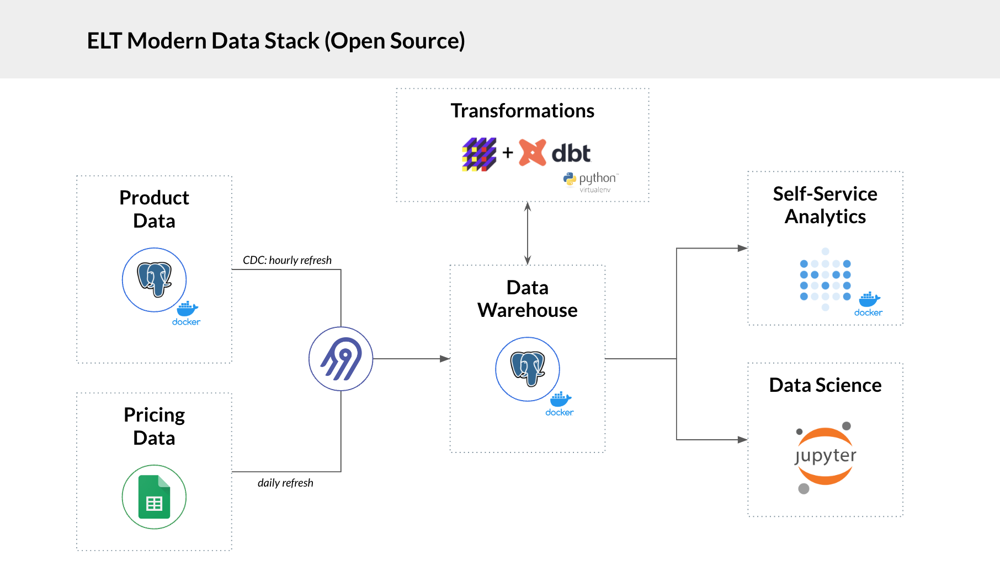
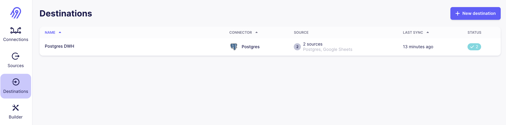
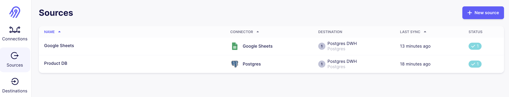
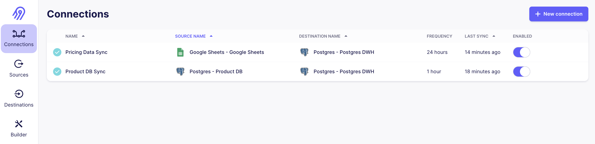
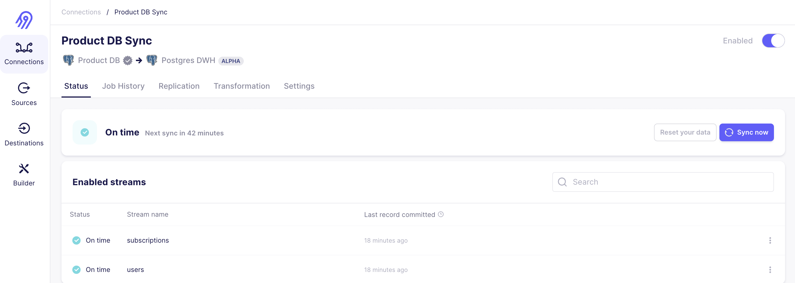
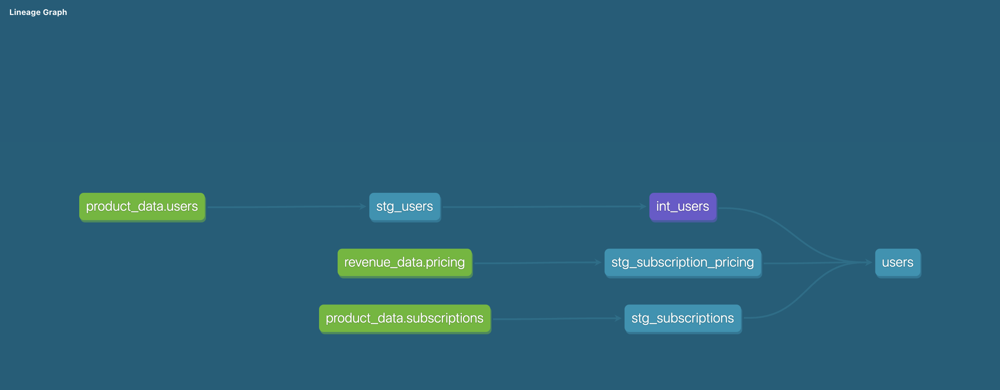
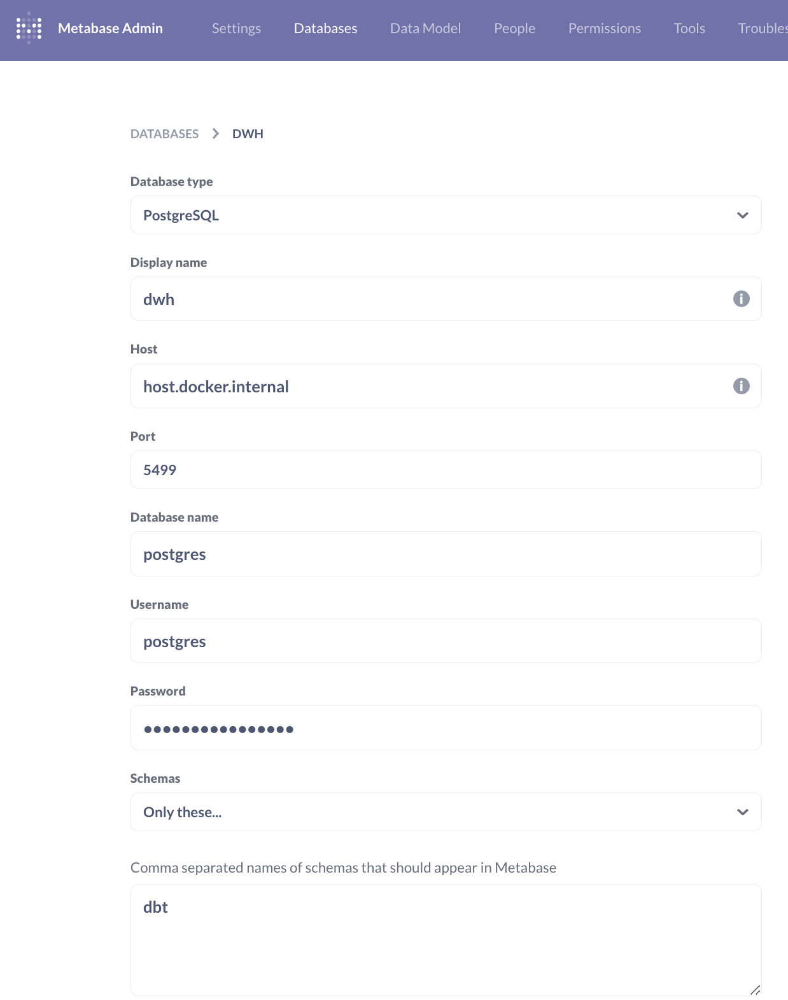
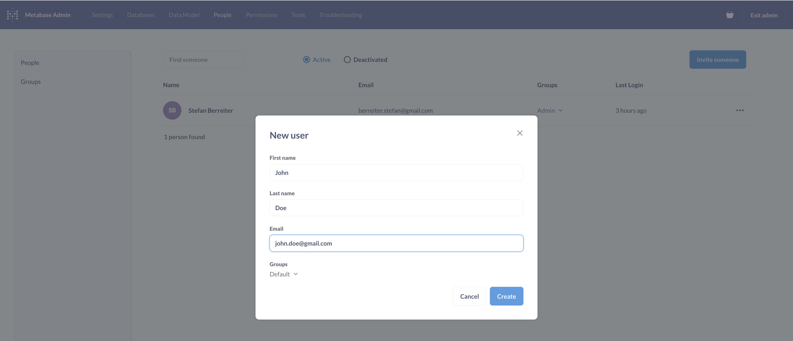
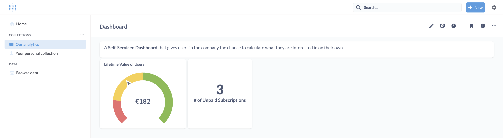
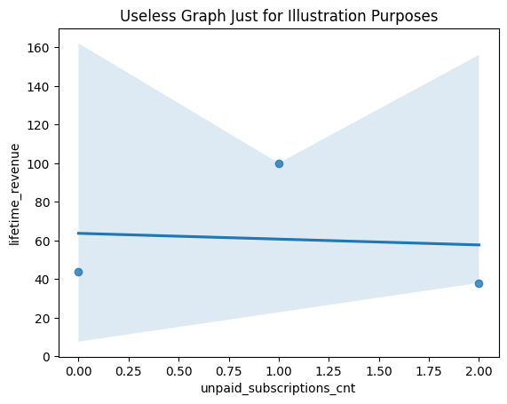

# Modern Data Stack (Open Source)
A project where I build a lightweight data infrastructure with Open Source tooling aimed at self-hosting the Modern Data Stack.




# Stack
* Data Sources:
  * SaaS Product Database: Postgres (users, actions)
  * Revenue/Ops Data: Google Sheets
* Data Ingestion: Airbyte
* Data Transformation: dbt and dbt-fal
* Reporting / BI: Metabase
* Data Science / Exploration: pandas (seaborn)


### Project Structure
```
├── airbyte
│   ├── ... # incl. cloned Airbyte source code
├── doc
│   ├── ... # screenshots for documentation
├── dbt
│   ├── ...  # dbt project folders
│   ├── dbt_project.yml  # storing key config of dbt project
│   ├── Makefile  # handy functionality to easy terminal commands
│   ├── profiles.yml  # storing key config of dbt project
│   ├── requirements.txt  # dependencies for the dbt project
├── docker-compose.yaml  # spinning up dbs
├── storage
│   ├── docker-compose.yaml  # spinning up Postgres Source DB and DWH
├── README.md
```

## Airbyte
[Airbyte](https://airbyte.com/) is an open-source data integration engine that helps you consolidate your data in your data warehouses, lakes and databases. It's the open source alternative to Fivetran or Stitch.

### Set-it up
```shell
git clone https://github.com/airbytehq/airbyte.git
cd airbyte
./run-ab-platform.sh
```

### Destination

For our use case, we set up a destination Data Warehouse where we will load the extracted data. We'll choose the Postgres Destination and need to provide usual db credentials. 



### Sources
We'll need to connect to another Postgres DB, our product database which powers our "hypothetical SaaS app". Often, further information for revenue or operations is located in Google Sheets, where we load pricing data.




#### Speciality for setting-up Postgres
To connect to another Postgres DB, that's a good scenario for using CDC (change data capture). We need to make some adjustments to our source database though to periodically stream changes to the destination DWH.

In order to make CDC work, we need to create a user for airbite, change the WAL (write-ahead-log) settings as well as create a replication slot. See below commands:

```sql
/*
Create Airbyte user to read data changes from product schema
*/
create user airbyte_product password 'airbyte_product';
grant usage on schema product to airbyte_product;
grant select on all tables in schema product to airbyte_product;
alter default privileges in schema product grant select on tables to airbyte_product;
alter user airbyte_product replication;

/*
Configure Postgres for logical replication
*/
alter system set wal_level = logical;
alter system set max_wal_senders = 4;
alter system set max_replication_slots = 5;
show max_replication_slots; -- restart DB to refresh with new settings

/*
Create replication slot for publicating the product schema
*/
SELECT pg_create_logical_replication_slot('airbyte_slot', 'pgoutput');
alter table product.users replica identity default;
alter table product.subscriptions replica identity default;
create publication airbyte_publication for all tables;
select * from pg_replication_slots; -- cmd to validate the replication slot
```

### Connections


Connecting to a Google Sheet requires some adjustments in Google (out of scope for this write-up) for authentication. Other than that, connecting to the GSheet is quite straight forward.

For connecting to the Postgres Source DB, we require now the names for the publication and the replication slot on top of usual connection details (re-using the airbyte user from above). We end up with all tables in the schema `product` being syned to the Data Warehouse.



### End Result

We end up with 3 tables periodically loaded to our database.
- `product.users` storing user information (id, name)
- `product.subscriptions` monthly subscriptions (start, end, type, paid, user_id)
- `public.pricing` (GSheets) pricing information and when applicable

## Transformations with DBT and DBT-Fal
[dbt](https://www.getdbt.com/) is an intuitive, collaborative platform that lets you reliably transform data using SQL and Python code.

Using multi-layered transformations, we:
- integrate and test raw sources from the previous three data-sets
- create staging models (prefixed with `stg`)
- bring data together in a data mart (e.g. `users` view which includes revenue data while leveraging all 3 datasources)

Below you can see the dbt documentation and the auto-generate DAG for this little project.




How to get started
```shell
dbt run
dbt build  # for running tests as well
```

## Metabase
[Metabase](https://www.metabase.com/) is for business intelligence and offers a wide range of dashboards, and data visualization tools. It allows you to dig deeper into your data with open source, no SQL tools for data visualization. This is a perfect fit for making data available in the whole company.

To connect to the dockerized postgres instance, we need to provide a special host name `host.docker.internal` as well as the usual connection details. We only allow access to `dbt` schema to not confuse the audience.



Inviting users allows to add employees to join the platform and create analytics on their own.


Playing around with the data from the DWH, the users can answer their own questions with the help of Metabase. Such a dashboard could be like the one below which uses the previously prepared data via dbt.


## Data Science / Data Analysis

Data Scientist would likely connect with pandas read_sql easily to the DWH using a sqlalchemy engine.
A quick script is available in a Jupyter notebook in the data_science folder - below you can find an easy visualization with the seaborn library.




## Appendix

If you want to reproduce the setting, you want to fill the Source DWH with the following
data.

```sql
/*
 Data structures for Product DB.
 Users table as well as subscriptions which
 are monthly payments.
 */

create schema product;

drop table if exists product.users;
create table product.users (
    user_id serial
    , name varchar
);

insert into product.users (name)
values ('John Doe'),
       ('Jane Doe'),
       ('Jonathan Foo');

drop table if exists product.subscriptions;
create table product.subscriptions (
    id serial
    , start_date date
    , end_date date
    , user_id int
    , subscription varchar
    , paid boolean
);
insert into product.subscriptions (start_date, end_date, user_id, subscription, paid)
values
       ('2023-01-01', '2023-01-31', 1, 'starter', true),
       ('2023-02-01', '2023-02-28', 1, 'starter', true),
       ('2023-03-01', '2023-03-31', 1, 'medium', true),
       ('2023-04-01', '2023-04-30', 1, 'medium', true),
       ('2023-05-01', '2023-05-31', 1, 'medium', true),
       ('2023-01-01', '2023-01-31', 2, 'enterprise', true),
       ('2023-02-01', '2023-02-28', 2, 'enterprise', true),
       ('2023-03-01', '2023-03-31', 2, 'enterprise', true),
       ('2023-04-01', '2023-04-30', 2, 'enterprise', true),
       ('2023-05-01', '2023-05-31', 2, 'enterprise', false),
       ('2023-01-01', '2023-01-31', 3, 'medium', true),
       ('2023-02-01', '2023-02-28', 3, 'starter', true),
       ('2023-03-01', '2023-03-31', 3, 'starter', true),
       ('2023-04-01', '2023-04-30', 3, 'starter', false),
       ('2023-05-01', '2023-05-31', 3, 'starter', false);
```
