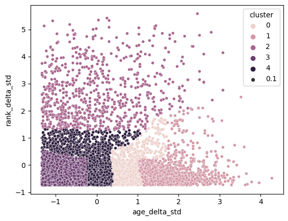

# modern-data-stack
A playground project where I aim to explore Modern Data Stack technologies.

The Goal is to build a Data Project around the domain **worldclass ATP tennis statistics** whilst leveraging latest **Modern Data Stack** technologies.

## Get-started

### Project Structure

```
├── orchestrator_dagster
│   ├── ...  # currently just exploration
├── tennis_stats
│   ├── ...  # dbt project folders
│   ├── dbt_project.yml  # storing key config of dbt project
│   ├── Makefile  # handy functionality to easy terminal commands
│   ├── profiles.yml  # storing key config of dbt project
│   ├── requirements.txt  # dependencies for the dbt project
├── docker-compose.yaml
├── README.md
```

### Install Dependencies
```shell
cd tennis_stats
virtualenv venv
source venv/bin/activate
pip install requirements.txt
```

### Spin-Up a Postgres Data Warehouse
We are using a Postgres Warehouse (dockerized)
which you can easily spin up using the following command.
Having this up and running is obviously important to run any data logic.

```shell
cd modern_data_stack
docker compose up
```

## Run DBT Pipeline

### dbt DAG


The Pipeline is leveraging **dbt** as well as the **dbt-fal** adaptor to leverage both dbt and python elt operations.

Python is used to:
- Ingest data from an Open Dataset from [web](https://github.com/JeffSackmann/tennis_atp): `matches` 
- Run a Machine Learning algorithm (scikit-learn): `int_similar_matches`

SQL is used to:
- Build staging model: `stg_matches`
- Build a metrics metadata model building on the Machine Learning model: `match_cluster_metadata`

### Run Pipeline
You can start the pipeline executing following commands in the terminal.

```shell
cd tennis_stats
make run-pipe
```


### Clustering Output
Tennis Matches are assumed to be similar along the dimensions of:
- how far the 2 opponents differ in their age
- how far the 2 opponents differ in their ranking

Running a KMeans Clustering Algorithm returns 5 Game Clusters.



The Clusters are done via the degree of similarity in age and ranks of the two players.

This yields e.g. Clusters of Matches where a Youngster seems to have challenged an Oldie, but with quite close rankings (e.g. Cluster 5). 

Or in Cluster 7, where two around equally old players with around equal rankings played against each other - in likely tough match on paper.


| cluster\_name | age\_delta\_avg | rank\_delta\_avg | matches\_cnt |
| :--- | :--- | :--- | :--- |
| Cluster 0 | 8.415495867768604 | 708.030303030303 | 1452 |
| Cluster 1 | 4.777364505844844 | 538.1987247608927 | 1882 |
| Cluster 2 | 9.863535911602199 | 4142.008287292818 | 362 |
| Cluster 3 | 2.6153225806451617 | 5378.279569892473 | 372 |
| Cluster 4 | 6.431465517241378 | 8647.366379310344 | 232 |
| Cluster 5 | 13.16321321321321 | 762.3213213213213 | 666 |
| Cluster 6 | 2.9125820568927807 | 2366.5175054704596 | 914 |
| Cluster 7 | 1.5203908241291424 | 521.429056924384 | 2354 |
| No Prediction \(poor data\) | 6.877192982456136 | 855 | 125 |


## Appendix

You can run the dbt Documentation server giving a UI for the DAG via:

```shell
cd tennis_stats
make serve-docs
```